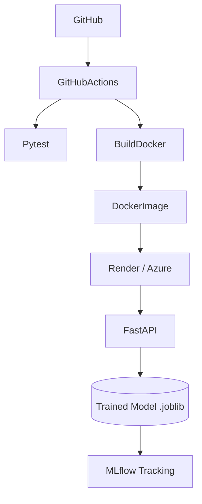

# 🛒 Walmart Sales Forecasting MLOps Project

## 📖 Overview
This project is an end-to-end Machine Learning and MLOps application that predicts Walmart weekly sales using historical sales data and external economic indicators. It follows production-ready software engineering practices, including automated testing, experiment tracking, containerization, CI/CD, and cloud deployment.

## 🎯 Objectives & Features
* **Machine Learning Pipeline:** Predict weekly sales using Regression models (Scikit-Learn, XGBoost, LightGBM).
* **MLOps Integration:** Experiment tracking with MLflow and model versioning.
* **API & Serving:** REST API built with FastAPI, including health checks, single predictions, batch predictions, and drift reporting.
* **Engineering Best Practices:** Docker containerization, automated testing via Pytest, and CI/CD via GitHub Actions.
* **Monitoring:** Lightweight drift reporting and prediction logging for operational visibility.

## 🏗️ Project Architecture


## 🚀 Quick Start

### 1. Prerequisites
* Python 3.12+
* Docker Desktop
* Git

### 2. Installation
```bash
git clone https://github.com/<your-username>/walmart-sales-api.git
cd walmart-sales-api
python -m venv .venv
# Activate: source .venv/bin/activate (Linux/Mac) or .venv\Scripts\activate (Windows)
pip install -r requirements.txt
```

### 3. Environment Configuration
Copy the example environment file and fill in your variables:
```bash
cp .env.example .env
```
Ensure your `config/config.yaml` is set up with correct paths and hyperparameters.

### 4. Running the Project
* **Formatting & Linting:** `black .` and `ruff check .`
* **Tests:** `pytest`
* **API Server:** `uvicorn api.main:app --reload`
* **MLflow UI:** `mlflow ui`
* **Drift Report:** `python -m src.drift_monitor`

### 5. API Examples
```bash
curl http://127.0.0.1:8000/health

curl -X POST http://127.0.0.1:8000/predict \
  -H "Content-Type: application/json" \
  -d '{"Store":1,"Holiday_Flag":0,"Temperature":55,"Fuel_Price":3.4,"CPI":210,"Unemployment":7.5,"Month":8,"WeekOfYear":32,"Year":2024}'

curl -X POST http://127.0.0.1:8000/predict/batch \
  -H "Content-Type: application/json" \
  -d '[{"Store":1,"Holiday_Flag":0,"Temperature":55,"Fuel_Price":3.4,"CPI":210,"Unemployment":7.5,"Month":8,"WeekOfYear":32,"Year":2024},{"Store":2,"Holiday_Flag":1,"Temperature":60,"Fuel_Price":3.6,"CPI":215,"Unemployment":8.1,"Month":9,"WeekOfYear":35,"Year":2024}]'
```

## 🛤️ Project Phases

The development of this project is structured into several core phases:

### Phase 1: Environment Setup & Data Ingestion
* Configured the Python environment, dependencies (`requirements.txt`), and code quality tools (Ruff, Black).
* Converted raw CSV data into compressed Parquet formats for faster loading and processing.
* Set up foundational project directories.

### Phase 2: Exploratory Data Analysis (EDA) & Cleaning
* Performed deep-dive statistical analysis on Walmart sales and economic factors.
* Handled missing values, outliers, and incorrect data types.
* Created visualizations in Jupyter Notebooks to understand seasonal trends and feature correlations.

### Phase 3: Feature Engineering
* Engineered new time-based features from dates (week of year, month, holiday flags).
* Applied standard scaling to numerical variables and encoding to categorical variables.
* Split the dataset into reproducible train, validation, and test sets.

### Phase 4: Model Training & Experiment Tracking
* Trained multiple regression models including Random Forest, XGBoost, and LightGBM.
* Used **MLflow** to track all hyperparameters, metrics (RMSE, MAE, R2), and model artifacts.
* Registered the best-performing model as a `.joblib` artifact for production serving.

### Phase 5: API Development & MLOps
* Built a **FastAPI** application to expose the trained model via a REST endpoint.
* Implemented request validation using Pydantic schemas with realistic business-range constraints.
* Added health, prediction, batch-prediction, and drift-report routes.
* Added prediction logging and basic API tests using **Pytest**.

### Phase 6: CI/CD & Deployment
* Added a Dockerfile to containerize the FastAPI application.
* Added a GitHub Actions workflow to run tests automatically on push and pull requests.
* Prepared the project for cloud deployment using a standard container-based workflow.
* Added deployment-ready structure for future monitoring and drift checks.

## 📁 Project Structure Details
```text
walmart-sales-api/
├── .github/workflows/    # CI/CD Pipelines (GitHub Actions)
├── api/                  # FastAPI App (main.py, routes, schemas)
├── config/               # Configuration files (config.yaml, logging)
├── data/                 # Datasets
│   ├── raw/              # Original unaltered data
│   ├── interim/          # Cleaned data
│   └── processed/        # Feature engineered & split data
├── mlruns/               # MLflow local experiment tracking
├── models/               # Saved model artifacts (.joblib, scalers)
├── notebooks/            # Jupyter notebooks (01_eda, 02_cleaning, etc.)
├── reports/              # Generated plots, metrics, and drift reports
├── src/                  # Core Python modules
│   ├── preprocessing.py  # Data cleaning logic
│   ├── train.py          # Model training pipeline
│   ├── drift_monitor.py  # Lightweight drift report generator
│   └── inference.py      # Inference logic
├── tests/                # Pytest cases (test_api, test_features)
├── Dockerfile            # Docker configuration for production
└── pyproject.toml        # Tools config (Black, Ruff, Pytest)
```

## 📊 Dataset Overview
* **Name:** Walmart Sales Forecasting
* **Source:** Historical store data
* **Task:** Regression
* **Target Variable:** `Weekly_Sales`
* **Key Features:** 
  * `Store`: Store number
  * `Date`: Week of sales
  * `Holiday_Flag`: Whether the week contains a special holiday
  * `Temperature`, `Fuel_Price`, `CPI`, `Unemployment`: External economic factors impacting sales volume